# Sample images

Sample images for testing mathematical morphology operators.

### Plant tissues
* [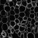](appleCells.tif) **(appleCells.tif)**: fresh apple tissue observed by macroscopy. Image used in the article "Détection semi-automatique de cellules de fruits charnus observés par microscopie confocale 2D et 3D", by D. Legland and M.-F. Devaux (2009), in Cahiers Techniques de l'INRA. (in french...). [pdf file](https://www6.inrae.fr/cahier_des_techniques/content/download/3256/31685/version/1/file/07_Legland_imag.pdf).
* [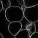](appleCells-crop.tif) **(appleCells-crop.png)**: a crop of the previous image, used in the presentation.
* [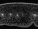](e4a1.tif) **(e4a1.tif)**: a slice of fresh tissue of tomato pericap observed by macroscopy, used to demonstrate texture analysis. Image used for the article "Cartography of cell morphology in tomato pericarp at the fruit scale", D. Legland et al., 2012, Journal of Microscopy. DOI: [10.1111/j.1365-2818.2012.03623.x](https://doi.org/10.1111/j.1365-2818.2012.03623.x)
* [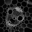](maize_clsm.tif) **(maize_clsm.tif)**: an image of a a vascular bundle within a maize tissue section, observed by confocal microscopy.

### Plant organs
*  **(arabidopsis-embryo.tif)**: an embryo of *Arabidopsis Thaliana*, observed by confocal microscopy. Image from article "Cell geometry determines symmetric and asymmetric division plane selection in Arabidopsis early embryos", by Julien Moukthar et al., 2019, PLOS Computational Biology. DOI: [10.1371/journal.pcbi.1006771](https://doi.org/10.1371/journal.pcbi.1006771)
* [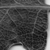](leaf_crop.tif) (**leaf_crop.tif**): a portion of an image of leaf. Image courtesy of Eric Biot, IJPB Versailles.
* [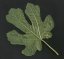](figtree_leaf.png) (**figtree_leaf.png**): an image of a fig tree leaf, obtained with flat scanner.
* [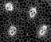](m02g_crop.tif) **(m02g_crop.tif)**: an image of a section of maze stem, observed by macroscopy. Image used in the article "Statistical mapping of maize bundle intensity at the stem scale using spatial normalisation of replicated images", by D. Legland et al., 2014, PLOS ONE. DOI: [10.1371/journal.pone.0090673](https://doi.org/10.1371/journal.pone.0090673)
* [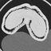](wheatGrain_tomo_180a_z630.tif) **(wheatGrain_tomo_180a_z630.tif)**: A cross-sectrion of a wheat grain observed by X-Ray tomography. Data from article "Use of X-ray micro computed tomography imaging to analyze the morphology of wheat grain through its development", by T. Le et al., 2019, Plant Methods. DOI: [10.1186/s13007-019-0468-y](https://doi.org/10.1186/s13007-019-0468-y). Full data set available at DOI: [10.5281/zenodo.3210475](https://doi.org/10.5281/zenodo.3210475).

### Synthetic images
* [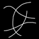](curves.tif) (**curves.tif**): a synthetic image representing several fibres with constant thickness that interesect each other. Used to demonstrate directional filtering.
*  (**particles.tif**): synthetic image representing several binary objets, some ones with holes, some ones touching image borders. Used to demonstrate morphological reconstruction.
* [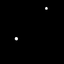](particles-markers.tif) (**particles-markers.tif**): an image of binary markers, used to demonstrate morphological reconstruction.

### Miscellaneous

* [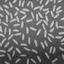](grains.tif) **(grains.tif)**: rice grains over a non uniform background, a standard test image of Matlab.
*  **(NucleiDAPIconfocal.png)**: DAPI-stained nucluei observed by confocal microsocopy.
* [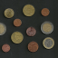](euro_coins.png) **(euro_coins.png)**: a collection of euro coins with various values.

