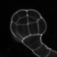

# Sample images

Sample images for testing mathematical morphology operators.

*  **(appleCells)**: fresh apple tissue observed by macroscopy.
*  **(appleCells-crop)**: a crop of the previous image.
*  **arabidopsis-embryo.tif**: En embryo of *Arabidopsis Thaliana*, observed by confocal microscopy. Image from article "Cell geometry determines symmetric and asymmetric division plane selection in Arabidopsis early embryos" [10.1371/journal.pcbi.1006771](https://doi.org/10.1371/journal.pcbi.1006771)
*  **(e4a1.tif)**: fresh tissue of tomato pericap observed by macroscopy -> texture analysis
*  **(grains.tif)**: rice grains over a non uniform background, a standard test image of Matlab.
*  (**leaf_crop.tif**): a portion of an image of leaf. Image courtesy of Eric Biot, IJPB Versailles.
* : an image of a section of maze stem, observed by macroscopy. Image used in the article "Statistical mapping of maize bundle intensity at the stem scale using spatial normalisation of replicated images", doi: [10.1371/journal.pone.0090673](https://doi.org/10.1371/journal.pone.0090673)
*  **(maize_clsm.tif)**: an image of a a vascular bundle within a maize tissue section, observed by confocal microscopy.
*  **NucleiDAPIconfocal.png**: DAPI-stained nucluei observed by confocal microsocopy.
*  **wheatGrain_tomo_180a_z630.tif**: A cross-sectrion of a wheat grain observed by X-Ray tomography. Data from article "Use of X-ray micro computed tomography imaging to analyze the morphology of wheat grain through its development", DOI: [10.1186/s13007-019-0468-y](https://doi.org/10.1186/s13007-019-0468-y)

